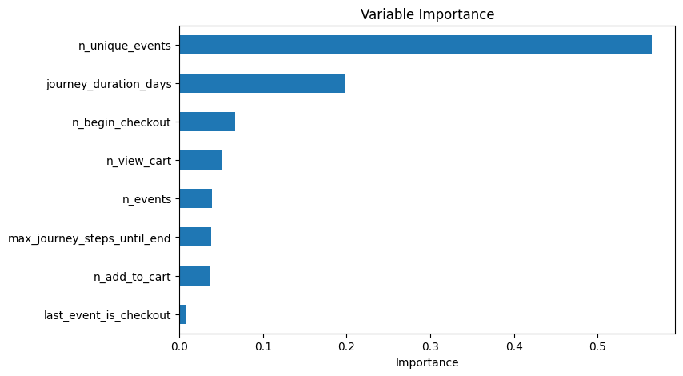

```{r}
#| label: load packages
#| include: false
library(tidyverse)
```

# Task 1 - Summarize complete journeys

There are two types *complete* journeys: successful and failed. A **successful journey** would be one where the journey ends with an order shipped. This means that no matter how long a journey takes, as long as it ends with a shipping of an order, it would be considered a successful journey. A **failed journey** is a journey that, at the cutoff point, hasn't had any activity for over 60 days. An *incomplete journey* would be one where the last activity was within the last 60 days (not including `order_shipped`).

# Task 2 - Create training data for incomplete journeys

Our training sets will consist of a slice of the completed journeys chosen at random cut points (before the given cutoff point). Each observation is labeled positive if the journey later ends with order_shipped or negative if it goes 60 days with no activity and never reaches order_shipped. As discussed in week 2, we are going to sample journey cut points proportional to the total length of each journey in order to avoid over-sampling successful journeys.



# Task 3 - fit a first predictive model for incomplete journeys

**OOB accuracy**: 0.9737917806496242

**Training accuracy**: 0.9998899474892305

{width=80%}