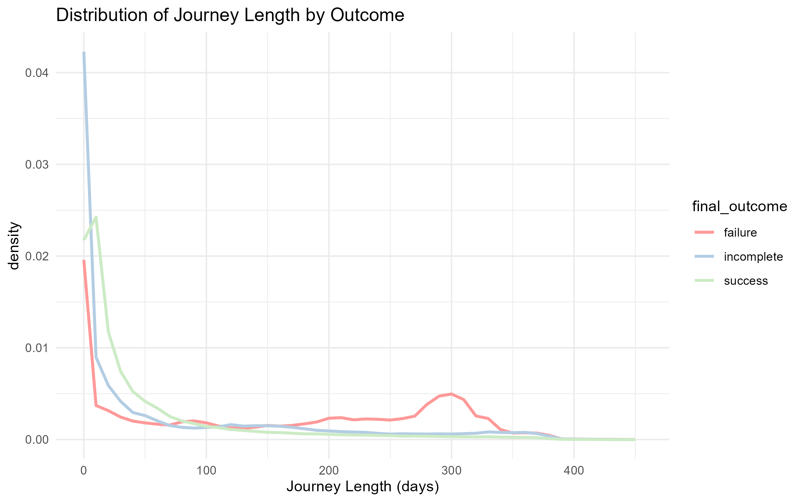
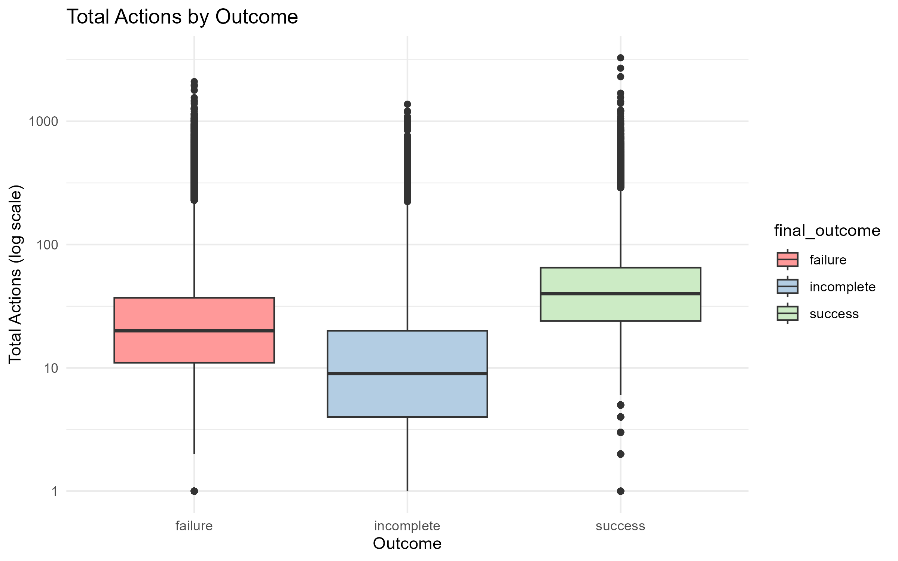
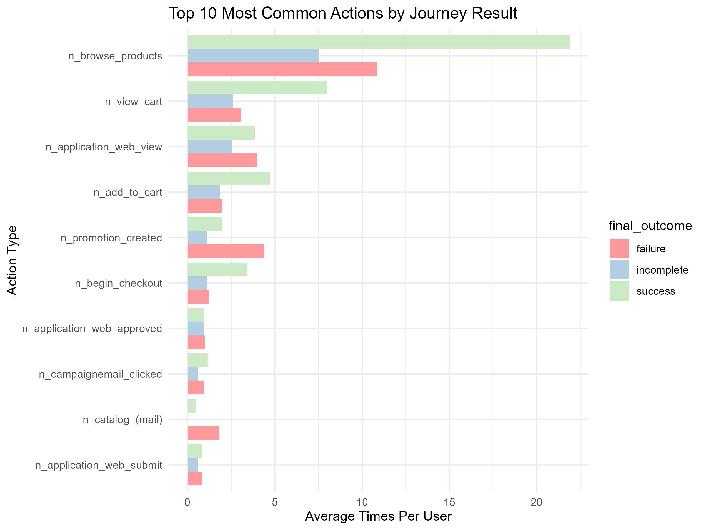
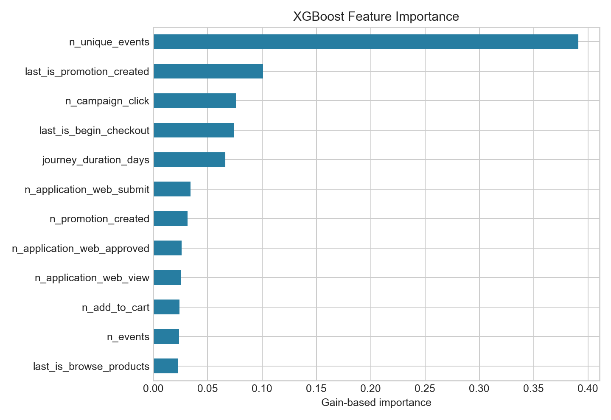
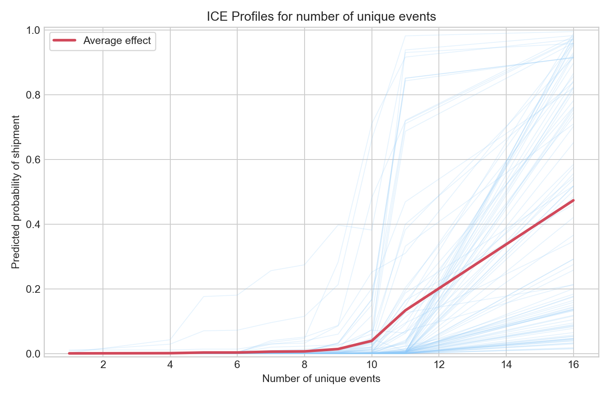
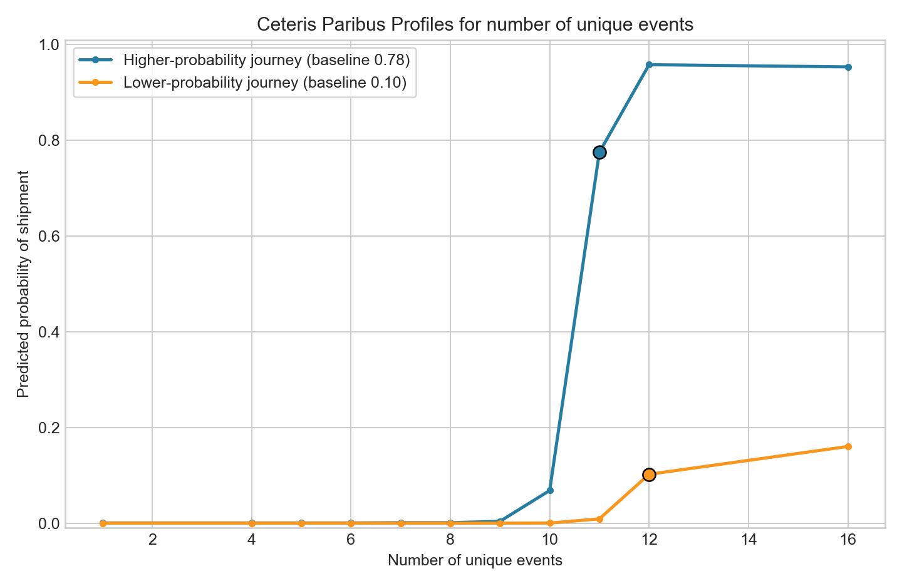
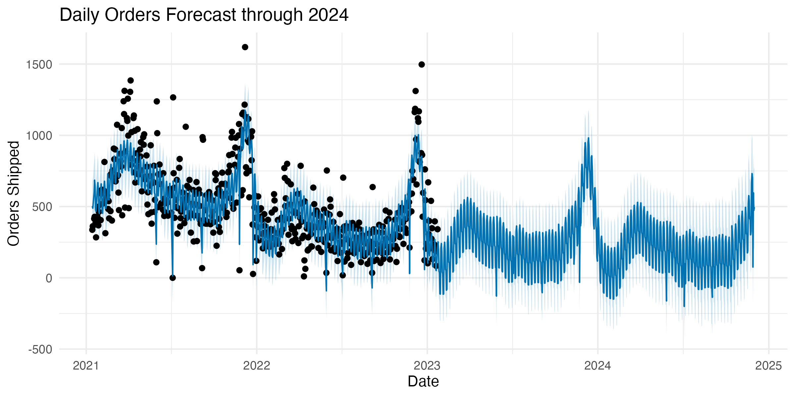
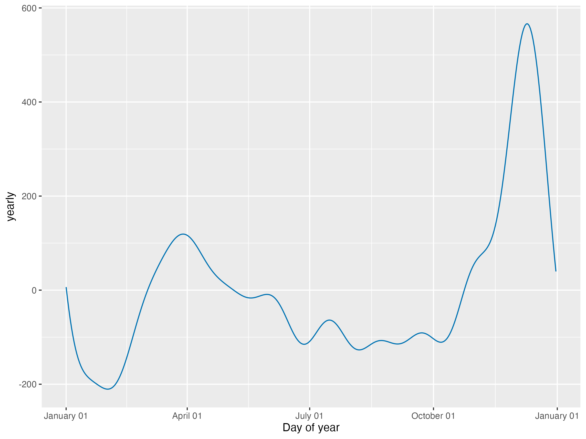
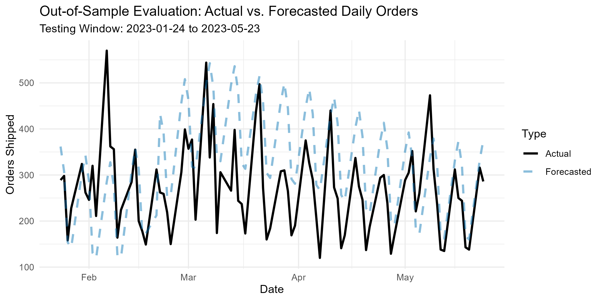

```{r}
#| label: setup
#| include: false
library(tidyverse)
```

<!-- Try your best to include lots of high quality visualizations and not too much
text. Shorter is better, please keep your report below 5 pages if you can. If you
have a lot of nice and large figures, you can go over. -->

# Introduction

Fingerhut is an online retailer whose shopping experience combines product discovery and purchasing with credit-account activity; WebBank identifies Fingerhut's Fetti Credit Account and FreshStart installment loan as its lending products.[^fingerhut-credit] This creates customer journeys that can include marketing interactions, credit applications, browsing, checkout, downpayment, account-management, and shipment events. Understanding how customers move through this funnel can help identify active customers who are likely to complete a purchase and support planning for future shipment volume.

Our data contain 51,848,861 deduplicated events from 1,430,445 customer journeys recorded between November 3, 2020 and January 23, 2023. We define a journey as all observed events associated with one anonymized ID and classify its status at the end of the observation period as follows:

- **Successful:** the journey contains an `order_shipped` event.
- **Unsuccessful:** the journey contains no `order_shipped` event and has been inactive for at least 60 days.
- **Ongoing (incomplete):** the journey contains no `order_shipped` event, but its most recent activity occurred within the final 60 days, so its outcome is not yet known.

This report first explores how activity and timing differ across these journey statuses. It then addresses two related prediction problems: estimating the probability that each ongoing journey will eventually produce a shipment, and forecasting the aggregate number of orders shipped over time. Together, these tasks connect customer-level conversion behavior with operational demand.

[^fingerhut-credit]: WebBank, ["Brand Partners"](https://www.webbank.com/brand-partners).

# Exploratory Data Analysis

Note: these visualizations are based on the second round of training data.

{width=80%}

{width=80%}

{width=80%}

# Task 1: Predictive Modeling of Ongoing Journeys

We modeled whether an ongoing customer journey would eventually end in an `order_shipped` event. To make completed journeys resemble the ongoing journeys seen at prediction time, we cut each completed journey at sampled intermediate points and calculated features using only the actions visible before each cut. We used an XGBoost classifier because its boosted trees can represent nonlinear effects and interactions among event counts, journey timing, and the customer's most recent activity.

To limit data leakage, features that directly reveal the outcome or occur very late in the purchase process were excluded. These included `n_order_shipped`, order-placement counts, downpayment counts, and the original action timestamps. We also downsampled successful journeys in training to better reflect their lower prevalence among ongoing journeys. XGBoost performed well and handled the large, sparse feature set, although its predictions are less directly interpretable than those from a regression model and may be sensitive to changes in customer behavior over time.

## XGBoost Model Interpretation

{width=75%}

The number of unique event types observed in a journey was the most important non-leaky feature, so we examined it using individual conditional expectation (ICE) and ceteris paribus (CP) profiles. Both methods vary this feature while holding all other journey features fixed.

{width=78%}

The ICE profiles show a nonlinear effect: predicted shipment probabilities are generally low for journeys with fewer than about ten unique event types, then rise as journeys include a broader range of actions. The large spread among the blue curves shows that event variety is not sufficient by itself; the effect depends strongly on the journey's other events and timing features.

{width=78%}

The CP profiles provide local explanations for two specific journeys. Increasing event variety sharply raises the higher-probability journey's prediction, while the lower-probability journey remains relatively unlikely to ship even at high values. This difference illustrates the interactions captured by XGBoost: otherwise favorable journey signals must also be present for event variety to translate into a high predicted probability. These profiles describe model behavior rather than a causal effect, and some hypothetical feature combinations may not occur naturally.

# Task 2: Forecasting Number of Orders Shipped

For this forecasting task we had to predict the number of orders shipped per day, which is a time series forecasting problem. We used the Prophet package, which is designed for forecasting time series data that may have multiple seasonalities and holiday effects.

To avoid an unnatural trend from the exclusion of ongoing journeys at the dataset's start-point, the first 71 days of observations were truncated based on the 80th percentile of complete journey lengths (71 days), and weekend entries were dropped to account for abnormally low shipping activity during warehouse closures.

Using this cleaned daily data, we fit a Prophet time series model incorporating US national holidays, weekly seasonality, and yearly seasonality to project future daily order volumes. Below are some visualizations of the models' forecast (through Dec 2024) and its components.

{width=80%}

{width=80%}

The model's primary strength is its ability to elegantly capture overlapping seasonal cycles and holiday effects directly and showcase their unique impacts. Below is an accuracy evaluation plot of our model trained on the first training set (dat_train1) and evaluated on the second training set (dat_train2). The model's forecasted values do a decent job of tracking the actual daily orders shipped.

{width=80%}

A key weakness that remains is our decision to drop weekends entirely rather than appending them to the adjacent weekday. Another limitation is not restricting the model's outcome to non-negative values, which could be addressed by log transforming orders shipped.

# Branching Out: LSTM Sequence Model

Our primary tree-based models require each journey to be flattened into summary features such as event counts and average time gaps. Although effective, this representation loses the order of events and may hide meaningful patterns in the path a customer takes. We therefore fit a recurrent neural network with a long short-term memory (LSTM) layer to model journeys directly as ordered event sequences. Unlike Prophet, which captures aggregate calendar patterns, the LSTM can combine timing with event types and browsing frequency at the individual customer level.

We implemented the model using the `keras3` package. Each journey was represented by its 100 most recent actions and the time gaps between them, with shorter journeys padded to a common length. The 27 distinct action types were passed through a 14-dimensional embedding layer, while time gaps were passed through a four-neuron dense layer. These representations were combined and supplied to an LSTM with 64 hidden units, which produced each journey's predicted probability of eventually reaching `order_shipped`.

The LSTM achieved a Brier score of 0.0425, compared with approximately 0.035 for our tree-based models. Its main advantage is that it learns directly from sequential event data with little manual feature engineering and can capture patterns that flattened features omit. However, it required more processing time for training and prediction, was less interpretable, and did not outperform the simpler tree-based approach. These results suggest that event order contains useful information, but further architecture tuning or a larger training run would be needed for the sequence model to improve predictive accuracy.

# Appendix

## Contributions of each team member

- **Charlie:** data cleaning, EDA, XGB tuning + fitting, prophet forecasting, LSTM
- **Isaiah:** data cleaning, XGB tuning + fitting, prophet forecasting
- **Joel:** data cleaning, XGB tuning + fitting, sampling strategy

**Contributions of AI:** brainstorming, learning NN package for fitting LSTM, learning Prophet package.
